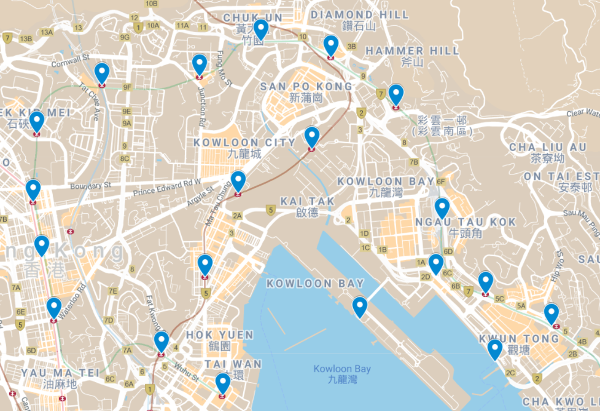
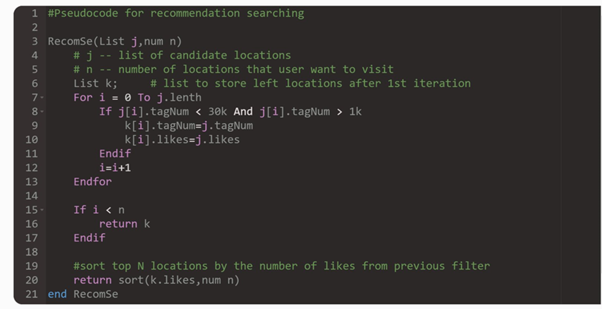

<!-- ## Welcome to _Gogogo!_ Project Homepage -->

This is the basic introduction of our project, including system illustration, system demonstration and a final project presentation with a validation trip.

We aim to design a trip planning system considering cost effectiveness, comfort and happiness for photograph lovers. 

The output recommended locations and paths were verified with a actual trip experiment. And we discover that our system's plan can recommend places suitable for photographing with few people and artistic scenery, and provide happy traveling experience with less boring transportation. 

## System Illustration
In this project, we prototype a one-day trip plan with public data and data-driven algorithms.  

Basically, our trip planning system encloses four main steps:
1. [Public Data Collection](#1-data-collection)
2. [Destination Recommendation](2-destination-recommendation)
3. [Path Planning](3-path-planning)
4. [Interactive Path Visualization](4-path-visualization-on-map)

For coding details, please refer to our Github repository. 

### 1. Data Collection
#### Nearby Area Search
We *roughly* figure out nearby areas (e.g., based on transportations) around the target traveling area.
These areas provide close places with large area.

For example, to explore candidate areas around _Kwun Tong Line_, we have these candidates:
<!--  -->


#### Basic Data Examples
Then based on nearby areas, we collected all related *"tags"* in [_Instagram_](https://www.instagram.com/), where people would like to share beautiful photos
with location and tags. And we can therefore collect location inforamtion (e.g., longitude and latitude) and place popularity information (e.g., # likes of a post).

Here shows some samples of our collected information from Instagram via data scraping.

``` 
tag_name,num_post,max_likes,top_post_url
ngoutaokok,6150,308,https://www.instagram.com/p/CHDGYcYhDBi
oimanestate,1110,425,https://www.instagram.com/p/CO8pnj9gNZ3
```

[Instagram search result with tag _#ngautaukok_](https://www.instagram.com/explore/tags/ngautaukok/) <br>
[Instagram search result with tag _#oimanestate_](https://www.instagram.com/explore/tags/oimanestate/) <br>
 

### 2. Destination Recommendation
After we collected destination candidates for photographing.
We proposed an enconomical filtering algorithm based on popularity and sustanabilty.

<!---->


### 3. Path Planning
We consider three different factors for path planning, _Calories_, _Cost_, and _Time_, indicating customized _Happy_ level.

- Happy level is provided by recommended destinations depending on its scenery beauty level and sufficiently few population, and other traveling experience such as energy consumption (calories), cost, and traffic time.
- Calories can be computed based on distance and path via some algorithm.
- Cost and transportation Time can be retrieved from some software, e.g., Google Map, CityMapper.

### 4. Path Visualization on Map
Finally, we visualize our recommended places and paths in [_Google MyMaps_](https://mymaps.google.com/).
We give an initial suggested map and path planning produced by our system.
And then the user can feel free to change locations and path in his own map.


## System Demonstration

Here is a short video clip of system demonstration (no audio):

<iframe width="560" height="315" src="https://www.youtube.com/embed/i3DSoiUEotE" title="YouTube video player" frameborder="0" allow="accelerometer; autoplay; clipboard-write; encrypted-media; gyroscope; picture-in-picture" allowfullscreen></iframe>


Please check more details in the [demo link](https://chenyingshu.github.io/gogogo/demo/).

## Empirical Trip
We take "Kwun Tong Line" as an experimental target area and input N = 6 destinations for trip planning. 

Our system output "Choi Hong Estate" > "Jimmy Bridge" > "Kai Tak Cruise Terminal" > "Kowloon City" > "Oi Man Estate" > "Whampoa Garden" recommended locations and travel paths.

Here are some photos taken by our travellers during the trip.

<div>
 TBD
</div>

## Project Presentation

<iframe width="560" height="315" src="https://www.youtube.com/embed/3rxb72IZaSg" title="YouTube video player" frameborder="0" allow="accelerometer; autoplay; clipboard-write; encrypted-media; gyroscope; picture-in-picture" allowfullscreen></iframe>

## Project Materials
 [](https://github.com/chenyingshu/gogogo/blob/main/Group9_Project_Report.pdf) **Report** 
 
 [](https://github.com/chenyingshu/gogogo)  **<\Code>**
